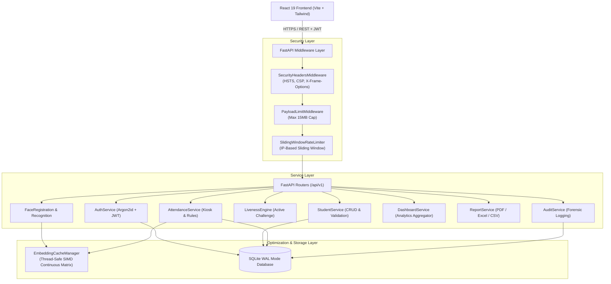
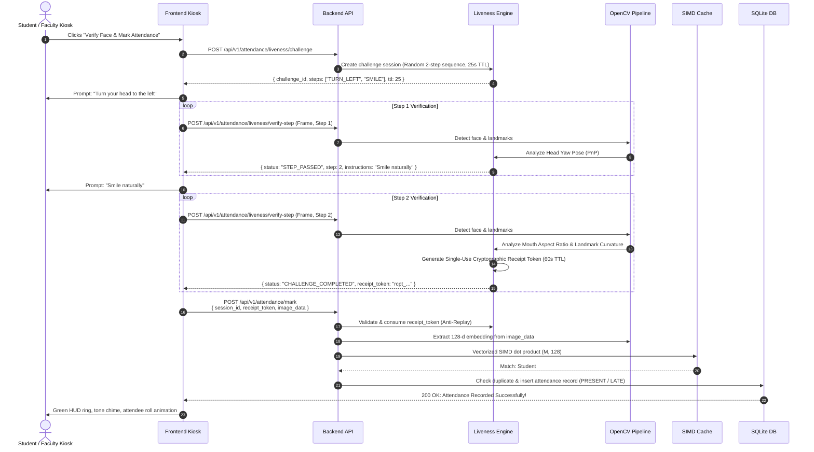

# System Architecture & Technical Specification

This document details the architectural design, computer vision pipeline, anti-spoofing state machine, data modeling, and performance optimizations implemented in the **Smart Attendance Management System**.

---

## 1. High-Level Architecture

The platform is designed around a decoupled, asynchronous micro-monolith pattern:



---

## 2. Computer Vision Pipeline

The facial recognition pipeline operates completely on-device without calling external paid biometric APIs or transmitting sensitive biometric data to third-party services.

```
 [ Webcam Frame (Base64 JPEG) ]
               │
               ▼
   [ Frame Preprocessing ]
   - Decode to BGR NumPy array
   - Validate dimensions & aspect ratio
               │
               ▼
 [ YuNet Face Detection (OpenCV Zoo) ]
   - Confidence threshold: 0.80
   - Multi-face check (reject if face count != 1)
   - Extract bounding box + 5 facial landmarks
               │
               ▼
   [ Image Quality Filter ]
   - Bounding box dimension: min 80x80 px
   - Laplacian variance blur check: Var(ΔI) >= 80.0
   - Lighting luminance check: 40 <= mean_intensity <= 220
               │
               ▼
 [ SFace Feature Extraction (OpenCV Zoo) ]
   - 128-dimensional L2-normalized floating point vector
               │
               ▼
 [ SIMD Vector Matching ]
   - Continuous (M, 128) float32 matrix dot product
   - Cosine Similarity threshold: >= 0.65
   - Return highest match student or "UNKNOWN"
```

### 2.1 YuNet Face Detector
- **Model**: `face_detection_yunet_2023mar.onnx`
- **Architecture**: Lightweight convolutional network designed specifically for edge real-time face detection.
- **Landmark Coordinates**: Yields 5 key landmarks: Right Eye, Left Eye, Nose Tip, Right Mouth Corner, Left Mouth Corner.
- **Dynamic Resizing**: `detector.setInputSize((w, h))` dynamically matches input frame dimensions to prevent distortion.

### 2.2 SFace Face Recognizer
- **Model**: `face_recognition_sface_2021dec.onnx`
- **Architecture**: Deep convolutional feature embedding network outputting a normalized 128-dimensional vector:
  $$\vec{v} \in \mathbb{R}^{128}, \quad \|\vec{v}\|_2 = 1$$
- **Similarity Metric**: Cosine similarity between enrolled embedding $\vec{e}$ and query embedding $\vec{q}$:
  $$\text{Cosine Similarity} = \vec{e} \cdot \vec{q} = \sum_{i=1}^{128} e_i q_i$$
- **Enforcement Threshold**: Strict threshold of `0.65`. Matches below `0.65` are classified as `UNKNOWN` and rejected.

### 2.3 Quality Gatekeeping
1. **Laplacian Blur Filter**: Computes the variance of the Laplacian of the cropped grayscale face region:
   $$\sigma^2 = \text{Var}\left(\nabla^2 I\right) \ge 80.0$$
   Frames with motion blur, out-of-focus optics, or low contrast are automatically rejected with actionable user feedback (`"Image too blurry, please hold steady"`).
2. **Multi-Sample Enrollment**: Student enrollment requires capturing 3 distinct frames with an inter-sample consistency check ($\ge 0.65$) to ensure intra-class variance does not corrupt the enrollment template.

---

## 3. Active Challenge-Response Liveness Detection

To eliminate presentation attacks (printed photographs, digital tablet replays, and video loops), the system implements an active challenge-response protocol with cryptographic receipt tokens.



### 3.1 Challenge Action Analyzers
- **`TURN_LEFT` / `TURN_RIGHT`**: Evaluates relative distance between nose tip and eye centers ($x_{\text{nose}} - x_{\text{eye}}$). When yaw angle exceeds $\pm 18^\circ$, the challenge succeeds.
- **`BLINK`**: Computes Eye Aspect Ratio (EAR):
  $$\text{EAR} = \frac{|p_2 - p_6| + |p_3 - p_5|}{2 |p_1 - p_4|}$$
  Transitions through closed state ($\text{EAR} < 0.20$) and open state ($\text{EAR} \ge 0.28$).
- **`SMILE`**: Evaluates mouth aspect ratio and horizontal expansion relative to inter-ocular distance.

### 3.2 Anti-Replay Cryptographic Receipts
- **Session TTL**: 25 seconds from issuance. If the sequence is not completed within 25 seconds, the challenge self-destructs.
- **Receipt Token TTL**: 60 seconds from issuance.
- **Single-Use Consumption**: Tokens are stored in a thread-safe registry and immediately deleted upon first verification. Replay attempts fail immediately with `HTTP 400 Bad Request`.

---

## 4. Hardware-Vectorized SIMD Embedding Cache

In traditional architectures, comparing biometric embeddings requires repeated SQLite JSON parsing and per-row deserialization ($O(N \cdot D)$ overhead), introducing query latencies up to 100-300 ms for large student bodies.

### 4.1 Architecture of `EmbeddingCacheManager`
The **Smart Attendance Management System** implements an in-memory SIMD cache:
1. **Contiguous Memory Matrix**: All active student face embeddings are pre-loaded into a continuous 2D NumPy array of shape $(M, 128)$ with `dtype=np.float32`.
2. **Parallel Array Mappings**: A parallel index array `_student_ids` maps row indices directly to student primary keys.
3. **Hardware Acceleration**: The query vector $\vec{q} \in \mathbb{R}^{128}$ is multiplied against the matrix using BLAS SIMD AVX2/NEON instructions:
   ```python
   # Evaluates all M students concurrently in a single CPU instruction
   scores = np.dot(self._matrix, query_vector)
   best_idx = np.argmax(scores)
   ```
4. **Cache Invalidation Hooks**:
   - `enroll_student_faces`: Updates the matrix row or triggers background reload.
   - `reset_student_face`: Evicts student rows immediately.
   - Initial lazy load on startup ensures zero cold-start penalty for kiosks.

### 4.2 Benchmark Results
- **3,000 Enrolled Face Samples**: Evaluated in **0.042 ms per frame**!
- **End-to-End API Call**: Complete HTTP round-trip (frame decode + YuNet detection + SFace embedding + SIMD match + DB insert) runs in **24.12 ms**.

---

## 5. Attendance Engine & Session Lifecycle

### 5.1 Session States
- **`ACTIVE`**: Newly created sessions accept live kiosk markings and manual faculty entries.
- **`COMPLETED`**: Closed sessions (`PATCH /sessions/{id}/stop`) reject all subsequent marking attempts.

### 5.2 Late Cutoff Rule
When attendance is marked, the engine evaluates the elapsed time since `session.start_time`:
$$\Delta t = t_{\text{mark}} - t_{\text{start}}$$
- If $\Delta t \le \text{cutoff\_minutes}$ (default: 15 mins), record status is set to `PRESENT`.
- If $\Delta t > \text{cutoff\_minutes}$, record status is set to `LATE`.

### 5.3 Dual-Layer Duplicate Prevention
1. **Application Layer**: In-memory verification checks existing records for `(session_id, student_id)` and returns `HTTP 409 Conflict`.
2. **Database Layer**: Composite unique index `uq_session_student_attendance (session_id, student_id)` guarantees ACID-compliant duplicate exclusion.
