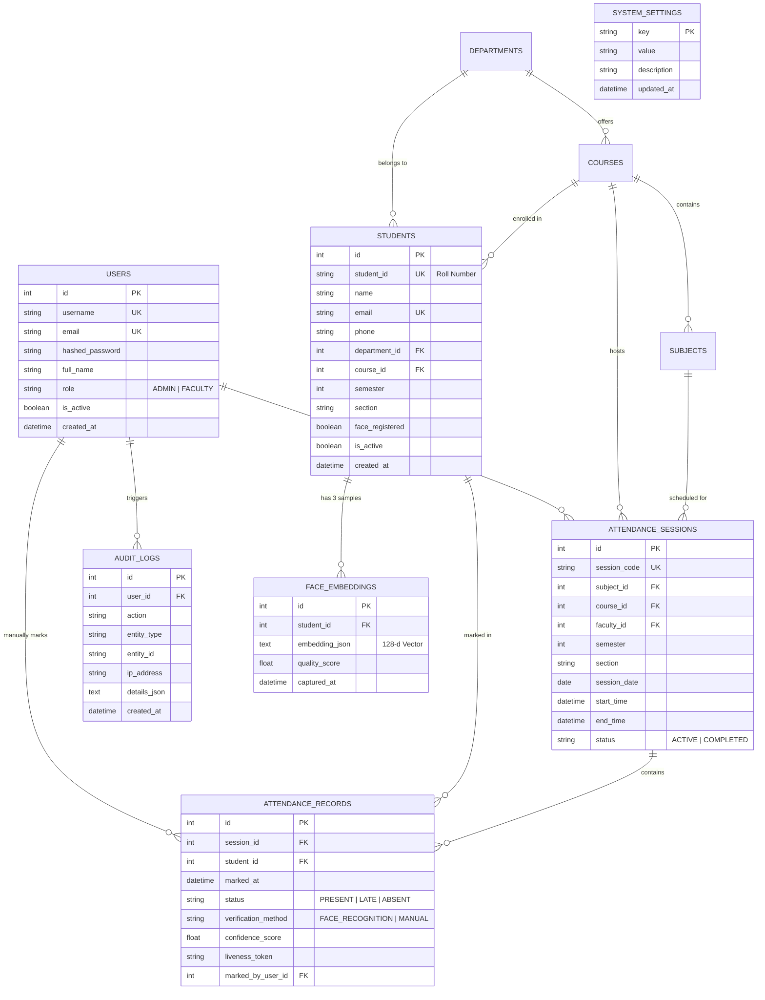

# Database Architecture & Schema Specification

This document details the relational data model, constraints, composite performance indexes, and cascade deletion policies implemented in the **Smart Attendance Management System**.

---

## 1. Database Configuration

- **Engine**: SQLite 3 with Write-Ahead Logging (`PRAGMA journal_mode = WAL;`)
- **Concurrency**: WAL mode allows concurrent readers and writers without database locking bottlenecks.
- **Foreign Key Enforcement**: `PRAGMA foreign_keys = ON;` is executed on every database connection.
- **ORM / Driver**: SQLAlchemy 2.0 (Declarative Async) with `aiosqlite`.

---

## 2. Entity-Relationship (ER) Diagram

---

## 3. Performance Indexes & Composite Constraints

To support real-time attendance lookups and millisecond reporting queries across thousands of records, explicit composite indexes are applied:

| Index Name | Target Table | Indexed Columns | Purpose |
| :--- | :--- | :--- | :--- |
| `uq_session_student_attendance` | `attendance_records` | `(session_id, student_id)` | **Unique Constraint**: Prevents duplicate attendance marking at the database layer. |
| `ix_attendance_student_marked` | `attendance_records` | `(student_id, marked_at)` | Accelerates individual student attendance deficit queries. |
| `ix_attendance_status_marked` | `attendance_records` | `(status, marked_at)` | Accelerates dashboard 7-day trend calculations (`PRESENT` vs `LATE`). |
| `ix_session_status_date` | `attendance_sessions` | `(status, session_date)` | Accelerates queries filtering for live `ACTIVE` lecture sessions. |

---

## 4. Referential Integrity & Cascade Rules

1. **Student Deletion (`ON DELETE CASCADE`)**:
   - When a student is removed via `DELETE /api/v1/students/{id}`, all associated `face_embeddings` records are automatically purged by SQLite to prevent orphaned biometric data.
2. **Session Records**:
   - `attendance_records` maintain a foreign key reference to `attendance_sessions` (`ondelete="CASCADE"`).
3. **Audit Trail**:
   - `audit_logs.user_id` is set to `SET NULL` on user deletion to preserve forensic audit logs even if a user account is removed.

---

## 5. Seed Data Summary

The database automatically initializes the following seed records on initial boot (`app/core/init_db.py`):
- **Departments**: Computer Science & Engineering (`CSE`), Electronics & Communication (`ECE`).
- **Courses**: Bachelor of Technology (`BTECH_CSE`, `BTECH_ECE`).
- **Subjects**: Data Structures & Algorithms (`CS301`), Operating Systems (`CS302`), Computer Networks (`CS303`), Digital Signal Processing (`EC301`).
- **Administrative Users**:
  - `admin` / `Admin@123` (`ADMIN`)
  - `dr.sharma` / `Faculty@123` (`FACULTY`)
- **Initial Students**: 5 pre-seeded students across Semesters 4 and 6 with designated roll numbers.
